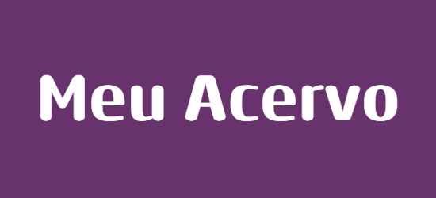

 

# Olá, sejam bem-vindos!

 

 
 

## Sobre
- Somos alunas da Uniesp do curso de Sistemas para Internet do UNIESP Centro Universitário de João Pessoa. Érika Veloso, Julia Matos, Mayara Fernandes, Richelle Monteiro.  
- Esse projeto é destinado a conclusão das disciplinas de Introdução à Programação e Tópicos Essenciais à Programação;

## Resumo sobre o projeto

O programa desenvolvido tem o intuito de ser um cadastro de biblioteca/acervo pessoal para controle.

## Linguagens utilizadas

- Python

## Recursos utilizados 

 

* GitHub

* Google

* Vscode

* ChatGPT

* Banco de Dados

